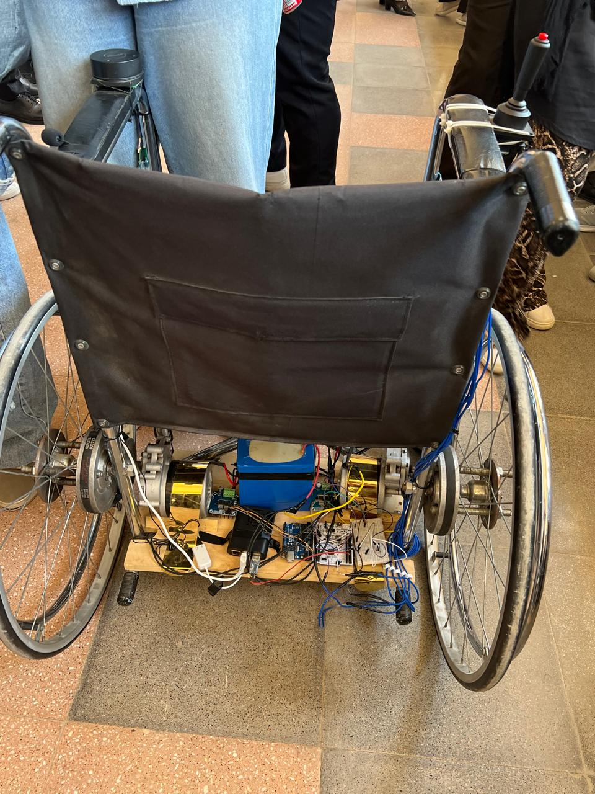
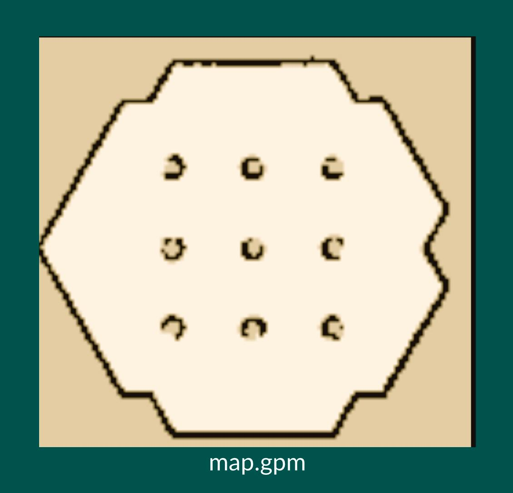

# Smart-mobility-Wheelchair

## 📌 Overview
This project is a Smart Mobility Wheelchair designed to assist people with mobility challenges.

The system uses ROS 2 for controlling movement and navigation, and LiDAR-based mapping (SLAM) to understand the environment and avoid obstacles.

The goal of the project is to build a semi-autonomous wheelchair that can safely move in unknown environments.

## 🚀 Features
- Autonomous navigation  
- Obstacle detection and avoidance  
- SLAM-based mapping  
- Real-time movement control  

## 🛠️ Technologies Used
- ROS 2  
- Python / C++  
- LiDAR Sensor  

## 👩‍💻 My Role
I worked on navigation logic and integrating SLAM for mapping the environment.

## 🎥 Demo
[▶ Watch Demo Video](https://github.com/shahdkhaled935/Smart-mobility-Wheelchair/blob/main/GRADproject.mp4)

## 📷 Images

